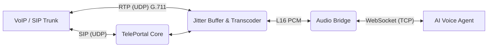

# TelePortal


TelePortal is a high-performance, zero-allocation bi-directional audio bridge. It is purpose-built for telephony and software developers who need to connect traditional VoIP systems (SIP/RTP) to modern, real-time AI voice agents over WebSockets.

By handling the complexities of SIP signaling, dynamic RTP port allocation, and adaptive jitter buffering natively, TelePortal provides a clean, low-latency, full-duplex JSON/Binary WebSocket interface for your AI backends.

---

## 📚 Documentation

Whether you are a DevOps engineer, a Telephony expert, or an AI developer, we have comprehensive guides to help you:

* **[DevOps & Deployment Guide](./docs/devops-documentation.md):** Kubernetes, Docker, required ports, and hot-reloading configurations.
* **[WebSocket API Specification](./docs/websocket-api-spec.md):** The complete reference for AI agents to connect, stream audio, and send DTMF.
* **[SIP Provider Integration](./docs/sip-provider-integration.md):** How to connect TelePortal to Twilio, AWS Chime, or local PBXs.
* **[Performance Tuning](./docs/performance-tuning.md):** OS kernel tuning (`sysctl`, `ulimit`) for handling thousands of concurrent calls.
* **[Troubleshooting & Diagnostics](./docs/troubleshooting-and-diagnostics.md):** Fixing one-way audio, generating stack dumps (`SIGQUIT`), and capturing PCAPs.
* **[Security & Compliance](./docs/security-and-compliance.md):** Securing signaling, WebSocket authentication (JWT), and managing recordings.
* **[Local Development Guide](./docs/local-development.md):** Using the built-in TUI load test tool and testing locally.
* **[SIP & RTP Reference](./docs/sip-documentation.md):** Deep dive into the internal telephony engine.

---

## 🚀 Key Capabilities

### Telephony & Media

> **For Telephony Engineers:** Please refer to the [SIP & RTP Reference Guide](./docs/sip-documentation.md) for detailed information on SIP methods, codec negotiation, NAT handling, and response codes.

* **Native SIP/RTP Signaling:** Robust, standard-compliant SIP handling (INVITE, ACK, BYE, CANCEL) utilizing `sipgo`.
* **Dynamic Symmetric RTP:** Automatic UDP port allocation and symmetric RTP handling for zero-hassle media streams and NAT traversal.
* **Bi-directional DTMF (RFC 4733):** Native detection of telephony digits from the caller and the ability for AI agents to inject digits into the outbound stream.
* **Adaptive Jitter Buffering:** High-quality audio reconstruction using industry-standard WebRTC jitter buffers (`pion/jitterbuffer`) to seamlessly handle network packet loss and variability.
* **On-the-fly Transcoding:** Built-in hardware-efficient translation from telecom standards (G.711 PCMU/PCMA) to AI-friendly L16 Little-Endian PCM.

### Developer Experience

* **Bi-directional Stereo Recording:** Automatically records both legs of the conversation (SIP Rx and WebSocket Tx) into synchronized, high-fidelity stereo WAV files for debugging and compliance.
* **JWT Security:** Optional token-based authentication to strictly secure WebSocket listener endpoints.
* **Observability:** Built for production with structured JSON logging (Uber Zap) and integrated Prometheus metrics for monitoring throughput, latency, and system health.
* **Shared API Types:** All API and WebSocket JSON messages are defined in `pkg/api` for easy direct import into Go-based client applications.

---

## ⚡ Performance & Reliability

TelePortal is engineered from the ground up for high-density, low-latency production environments. Its architecture has been empirically validated to handle **1,000+ concurrent bidirectional calls** on a single modest node.

> **See the Data:** Check out our full [Performance & Load Test Report](./docs/performance-graph.md) for detailed CPU, memory, and profiling metrics under peak load.

* **Zero-Copy RTP Pipeline:** RTP network packets are read directly into shared buffer pools. Payloads are extracted and passed through the jitter buffer without a single redundant memory allocation or copy.
* **Lock-Free Zero-Allocation WebSockets:** Audio data is streamed to WebSocket clients using direct stream reading (`NextReader`/`NextWriter`) and pooled buffers. This completely eliminates the massive memory churn and GC pauses typically associated with standard WebSocket libraries.
* **Deterministic Memory Footprint:** Fixed-size pre-allocations and pooled resources ensure that memory usage scales perfectly linearly (**~660 KB per active call**), preventing heap fragmentation and Out-Of-Memory (OOM) failures under extreme load.
* **Robust Lifecycle Management:** Every component follows a strict "Never Start Without Stopping" mandate. Goroutine leaks are prevented through rigorous `errgroup` context cancellation and comprehensive drain-on-shutdown logic.

---

## 🏗️ Architecture



---

## 💻 Quick Start

### Prerequisites

* **Go 1.26+**
* `staticcheck` (for QA: `go install honnef.co/go/tools/cmd/staticcheck@latest`)
* `fieldalignment` (for QA: `go install golang.org/x/tools/go/analysis/passes/fieldalignment/cmd/fieldalignment@latest`)
* Docker & Docker Compose (optional)

### Local Development

1. **Configuration:** Copy the sample environment file and adjust your SIP/RTP IPs and ports as needed.

   ```bash
   cp sample.env .env
   ```

2. **Run the Service:**

   ```bash
   make run
   ```

### Makefile Commands

| Command | Description |
| :--- | :--- |
| `make build` | Compile the `teleportal` binary into the `build/` directory. |
| `make run` | Build and run the service locally, injecting variables from `.env`. |
| `make test` | Run the native Go standard library test suite. |
| `make qa` | Run quality assurance linters (`go fmt`, `go vet`, `fieldalignment`, `staticcheck`). |

---

## 🌐 API & WebSockets

> **For AI Developers:** Please refer to the [WebSocket API Specification](./docs/websocket-api-spec.md) for a comprehensive guide on building AI agents that connect to TelePortal, including connection lifecycles, JSON schemas, and audio handling.

All core HTTP endpoints are cleanly versioned under `/v1`.

### Endpoints

* **Health Check:** `GET /healthz` (liveness), `GET /readyz` (readiness)
* **List Active Calls:** `GET /v1/calls`

### WebSocket Audio Bridge

* **Endpoint:** `GET /v1/listen/:internal_id/:call_id`
* **Authentication:** If enabled, requires an HTTP header: `Authorization: Bearer <jwt>`

#### JSON Message Types

| Direction | Type | Description |
| :--- | :--- | :--- |
| Server ➔ Client | `metadata` | Sent once on connection with codec and session info. |
| Server ➔ Client | `dtmf` | Notification of a detected DTMF digit from the SIP leg. |
| Server ➔ Client | `call_ended` | Notification that the SIP call has been terminated. |
| Client ➔ Server | `dtmf` | Request to inject a DTMF digit into the outbound RTP stream. |
| Client ➔ Server | `bye` | Request to gracefully terminate the SIP call. |

#### DTMF Examples

**Receive DTMF (Server ➔ Client):**

```json
{
  "type": "dtmf",
  "digit": "5",
  "duration": 160,
  "ts": 1715684400000
}
```

**Send DTMF (Client ➔ Server):**

```json
{
  "type": "dtmf",
  "digit": "9",
  "duration": 200
}
```

### Building Clients

If you are building an AI agent or a monitoring dashboard in Go, you can avoid redefining JSON schemas by importing them directly. The included high-performance client handles the WebSocket lifecycle and provides simple methods for audio and DTMF.

```bash
go get github.com/Heoruwulf/TelePortal
```

```go
import (
    tpapi "github.com/Heoruwulf/TelePortal/pkg/api"
    tpclient "github.com/Heoruwulf/TelePortal/pkg/client"
)

// Example usage:
client, err := tpclient.NewClient(ctx, tpclient.Config{...})

// Handle incoming DTMF
client.OnDTMF(tpclient.DTMFHandler(func(digit string, duration int) {
    fmt.Printf("Caller pressed: %s\n", digit)
}))

// Send DTMF to the user
client.SendDTMF(ctx, "1", 200)
```

---

## 🐳 Docker Deployment

TelePortal is fully containerized for immediate deployment. Thanks to a multi-stage build and a statically linked Go binary, the resulting Alpine-based container image is extremely lightweight (**~58.5 MB**).

```bash
docker-compose up --build
```

*Note: The Docker configuration uses `network_mode: "host"` by default. This is highly recommended to cleanly handle the vast dynamic range of UDP ports required for incoming and outgoing RTP media streams without incurring Docker proxy overhead.*

---

## ⚙️ Production Hardware Sizing

Because TelePortal is heavily optimized for zero-allocation networking, it runs exceptionally "cold." Based on empirical load testing, here are the minimum recommended hardware specifications to safely handle **1,000 concurrent bidirectional calls**.

### Recommended Spec: 2 vCPU / 4 GB RAM

* **Memory (RAM) - 4 GB:**
  * *Rationale:* During 1,000-call load tests (with Jitter Buffering and Stereo Recording active), the peak in-use memory reached approximately 0.9 GiB thanks to an optimized zero-allocation pipeline. Providing 4 GB gives the Go Garbage Collector ample "breathing room," making generation sweeps highly efficient and reducing CPU overhead during sudden traffic bursts.
* **Compute (CPU) - 2 vCPUs:**
  * *Rationale:* Handling 1,000 calls requires processing ~50,000 inbound audio packets per second. In our optimized load tests, this consumed only ~24% of a modern CPU. Having at least 2 vCPUs ensures that Go's garbage collector can run on one thread while real-time network polling (RTP UDP readers) continues uninterrupted on the other, absolutely preventing audio jitter.
* **Network & OS Limits (Critical):**
  * **Bandwidth:** 1,000 concurrent G.711 calls require approximately **80-100 Mbps** of symmetric, sustained bandwidth. Ensure your cloud instance guarantees at least 1 Gbps networking.
  * **File Descriptors (`ulimit`):** 1,000 calls equate to 1,000 active UDP sockets and 1,000 active TCP WebSockets. You **must** increase the OS file descriptor limit before starting the binary.
  * *Recommendation:* Run `ulimit -n 65535` or modify your systemd service limits accordingly.

---

## 📄 License

TelePortal is released under the **GNU Affero General Public License v3 (AGPL-3.0)**.

This ensures that the software remains free and open source, even when used as a network service. Any modifications to this codebase must be made publicly available under the same license. For more details, see the [LICENSE](./LICENSE) file.
