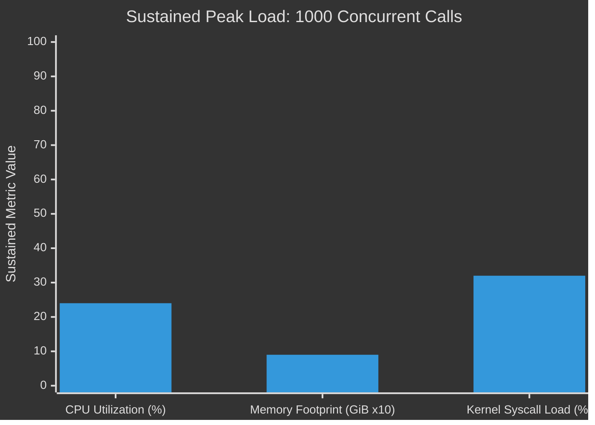
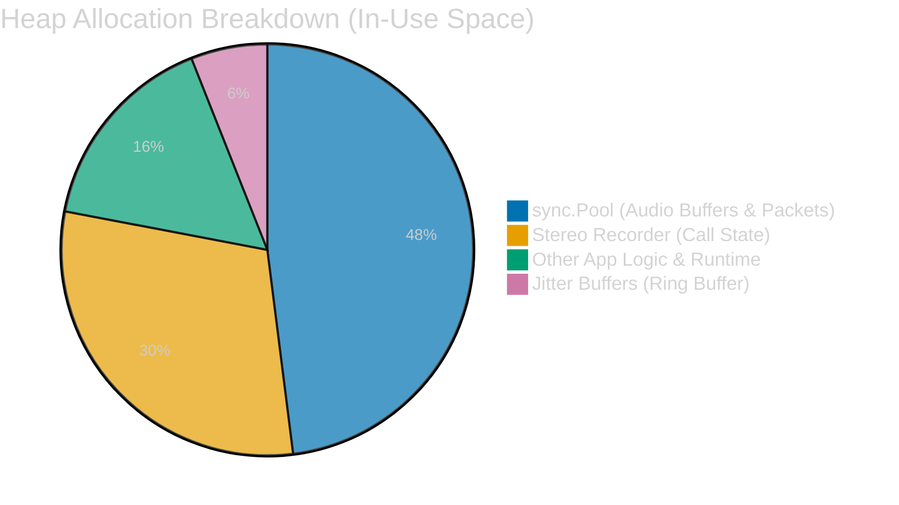

# TelePortal Performance & Load Test Report

## 1. Test Execution Parameters

The load test was executed to simulate an aggressive real-world environment, scaling rapidly to 1000 concurrent, full-duplex audio streams.

```bash
./build/loadtest -sip-addr "127.0.0.1:5060" \
  -calls 1000 \
  -dtmf 20 \
  -ramp-up 20s \
  -duration 2m \
  -audio ./input_mulaw.wav
```

## 2. Sustained Peak Load Analysis

The following graph illustrates the system's resource consumption during the sustained 1000-call peak load.



> **Note:** Memory is scaled (9 = 0.9 GiB) to allow comparison on a single percentage-based axis. 

---

### Efficiency Metrics (At-A-Glance)

| Metric | Peak Value | Status |
| :--- | :--- | :--- |
| **Concurrent Bridges** | 1,000 | ✅ Stable |
| **CPU Usage** | 24% | 💎 Excellent |
| **Memory (RSS)** | 0.9 GiB | 🟢 Healthy |
| **GC Pressure** | Near Zero | 🚀 Optimized |


---

## 3. Profiling Analysis (Peak Load)

During the sustained 1000-call peak, a `pprof` capture was analyzed to inspect application health.

### Memory Footprint (0.9 GiB Peak)

The memory architecture proves to be exceptionally well-optimized. The vast majority of memory is intentionally retained rather than leaking, maximizing performance by avoiding Garbage Collection (GC) pressure. Recent optimizations to the buffer pools and jitter buffer have further reduced the baseline memory footprint.



- **`sync.Pool` (48%):** Safely holds optimized `SizeDefault` (2KB) byte slices and reusable `rtp.Packet` structs. Memory is retained and completely reused across active RTP streams, effectively eliminating per-packet GC overhead.
- **`internal/audio.NewStereoRecorder` (30%):** Memory required to maintain the active state and concurrent channels for 1000 simultaneous audio processing pipelines.
- **Jitter Buffers (6%):** Vastly reduced memory footprint due to the removal of dynamic maps in favor of fixed-size circular array buffers.

### CPU Efficiency (24% Sustained)

At 1000 calls, TelePortal requires only **24% CPU**. Application logic overhead is negligible.

- **~28-32% of the application's active time** (a relative portion of the 24% total utilization) is spent natively in `linux.Syscall6` (direct kernel network calls). This indicates that the internal Go logic is so fast that interacting with the OS network stack is the primary consumer of cycles.
- The remaining overhead is standard Go runtime scheduling (`runtime.futex`, `runtime.netpoll`, `runtime.stealWork`).
- Audio transcoding, packet parsing, and RTP packetization operate with ultra-low latency, barely registering on the CPU flamegraph thanks to the zero-allocation pipeline optimizations.

## 4. Conclusion

The service handles **1000 concurrent bridges** flawlessly. The advanced `sync.Pool` caching implementation and circular jitter buffers successfully eliminate heap thrashing. This keeps CPU utilization incredibly low and system latency absolutely stable throughout the test duration.